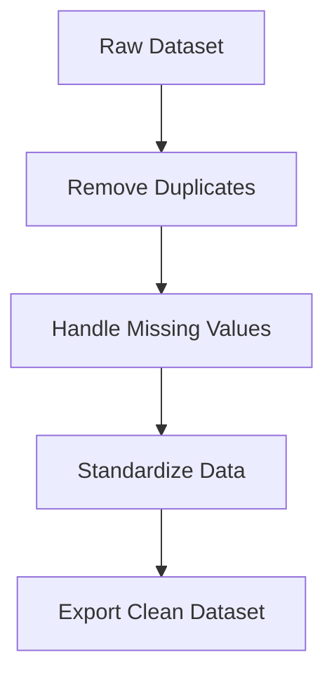

# 🌦️ Data Cleansing BMKG

Python script untuk membersihkan, merapikan, dan memproses dataset cuaca BMKG sehingga siap digunakan untuk analisis data, visualisasi, maupun machine learning.

---

## 📖 Overview

Project ini dibuat untuk mengotomatisasi proses data cleansing pada dataset BMKG yang masih mengandung:

- Duplicate records
- Missing values
- Format data tidak konsisten
- Data anomali

Hasil akhirnya adalah dataset yang lebih bersih dan siap digunakan untuk proses analisis lanjutan.

> ⚠️ Dataset asli tidak dipublikasikan karena alasan privasi dan kebijakan data. Repository ini hanya menampilkan source code dan contoh penggunaan.

---

## ✨ Features

- ✅ Duplicate Data Removal
- ✅ Missing Value Handling
- ✅ Data Standardization
- ✅ CSV Export
- ✅ Automatic Processing Pipeline

---

## 🔄 Workflow



---

## 📂 Project Structure

```text
Data_cleansing_bmkg/
│
├── cleansing.py
├── README.md
└── sample_output/
```

---

## 📊 Dataset Structure

Contoh struktur dataset yang digunakan:

| Column | Data Type |
|----------|----------|
| tanggal | Date |
| suhu | Float |
| kelembaban | Float |
| curah_hujan | Float |
| kecepatan_angin | Float |

---

## ⚙️ Installation

Clone repository:

```bash
git clone https://github.com/yogicodee/Data_cleansing_bmkg.git
```

Masuk ke folder project:

```bash
cd Data_cleansing_bmkg
```

Install dependency:

```bash
pip install pandas numpy
```

---

## 🚀 Usage

Jalankan script:

```bash
python cleansing.py
```

---
## 📈 Example Output

```bash
Dataset Loaded Successfully

Rows Before Cleaning : 15,234

Duplicate Rows Removed : 125

Missing Values Fixed : 56

Rows After Cleaning : 15,109

Clean Dataset Exported Successfully
```

---
